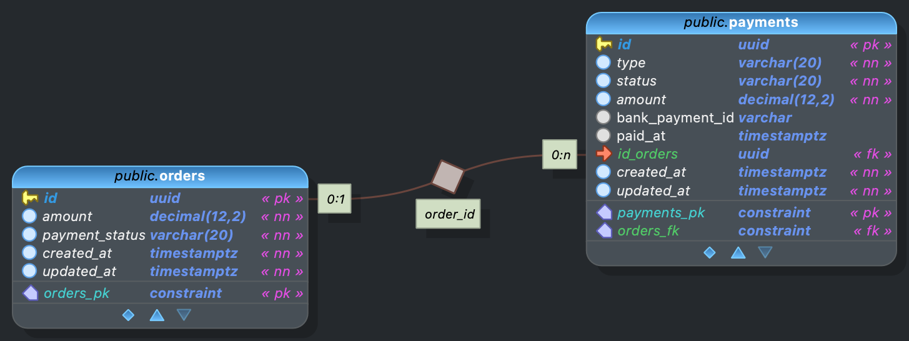

# Payment Service

Сервис работы с платежами по заказам.

## Стек

- Python 3.12, FastAPI, SQLAlchemy 2.0, Alembic, asyncpg
- PostgreSQL 16
- Docker, Docker Compose

## Запуск

```bash
cp backend/.env.example backend/.env
```

Отредактируйте `backend/.env` — укажите свои параметры подключения к БД.

```bash
docker compose up --build
```

Swagger UI: <http://localhost:8000/docs>

## Структура проекта

```text
testwork/
├── backend/
│   ├── app/
│   │   ├── core/           — конфигурация, БД, перечисления
│   │   ├── models/         — SQLAlchemy-модели (Order, Payment)
│   │   ├── repositories/   — репозитории (CRUD)
│   │   ├── schemas/        — Pydantic-схемы
│   │   ├── services/       — бизнес-логика
│   │   ├── clients/        — HTTP-клиент банка
│   │   ├── api/            — REST-эндпоинты
│   │   ├── utils/          — UoW, базовый репозиторий, зависимости
│   │   └── main.py         — точка входа FastAPI
│   ├── Dockerfile
│   └── pyproject.toml
├── documents/              — схема БД (pgModeler)
└── docker-compose.yml
```

## Архитектура

Layered: API → Services → UoW → Repositories → Models

## Схема БД


