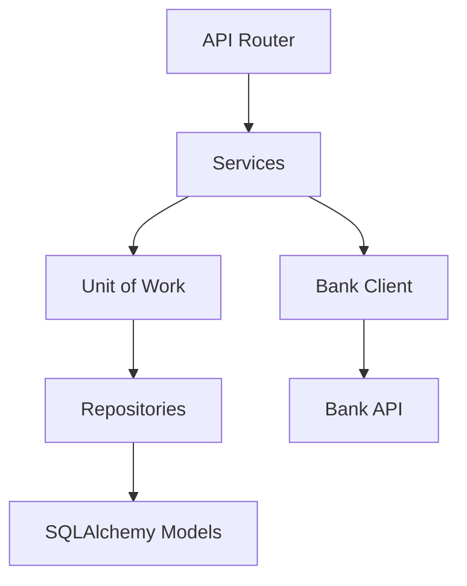
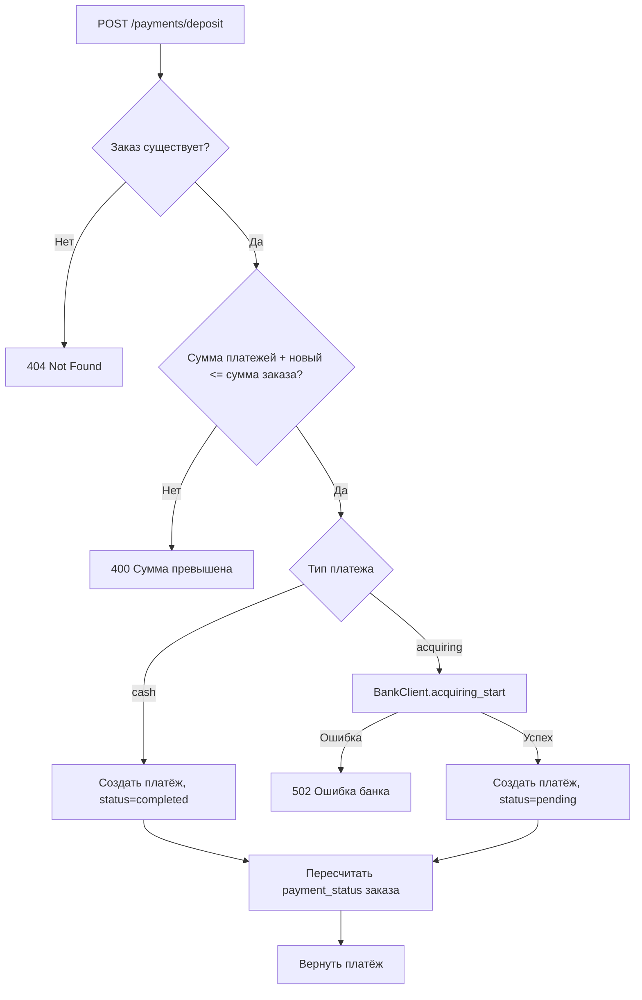
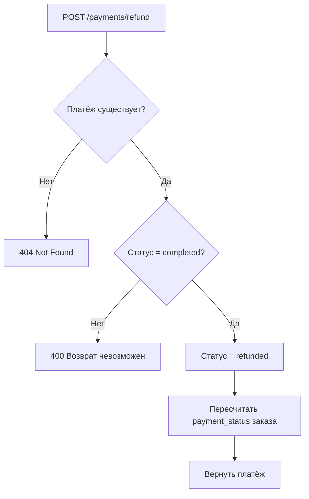
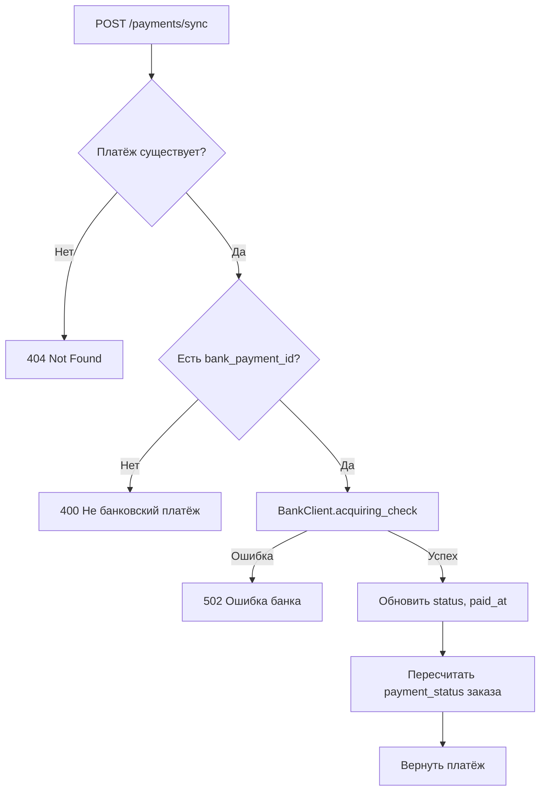
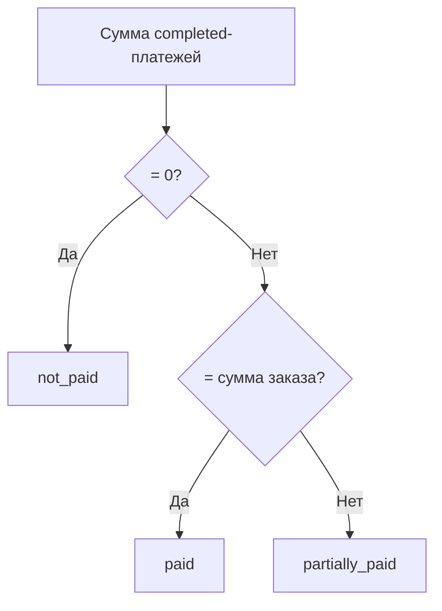

# Архитектура сервиса платежей

## Слои приложения

## Депозит — создание платежа

## Возврат платежа

## Синхронизация с банком

## Статусы

### Статус оплаты заказа (PaymentStatus)

| Значение | Описание |
| --- | --- |
| `not_paid` | Не оплачен — нет завершённых платежей |
| `partially_paid` | Частично оплачен — сумма платежей меньше суммы заказа |
| `paid` | Оплачен — сумма платежей равна сумме заказа |

### Тип платежа (PaymentType)

| Значение | Описание |
| --- | --- |
| `cash` | Наличные — платёж завершается сразу |
| `acquiring` | Эквайринг — платёж через банк, требует подтверждения |

### Статус платежа (TransactionStatus)

| Значение | Описание |
| --- | --- |
| `pending` | Ожидает подтверждения от банка |
| `completed` | Завершён — деньги получены |
| `refunded` | Возвращён |
| `failed` | Ошибка — платёж не прошёл |

## Пересчёт статуса заказа

