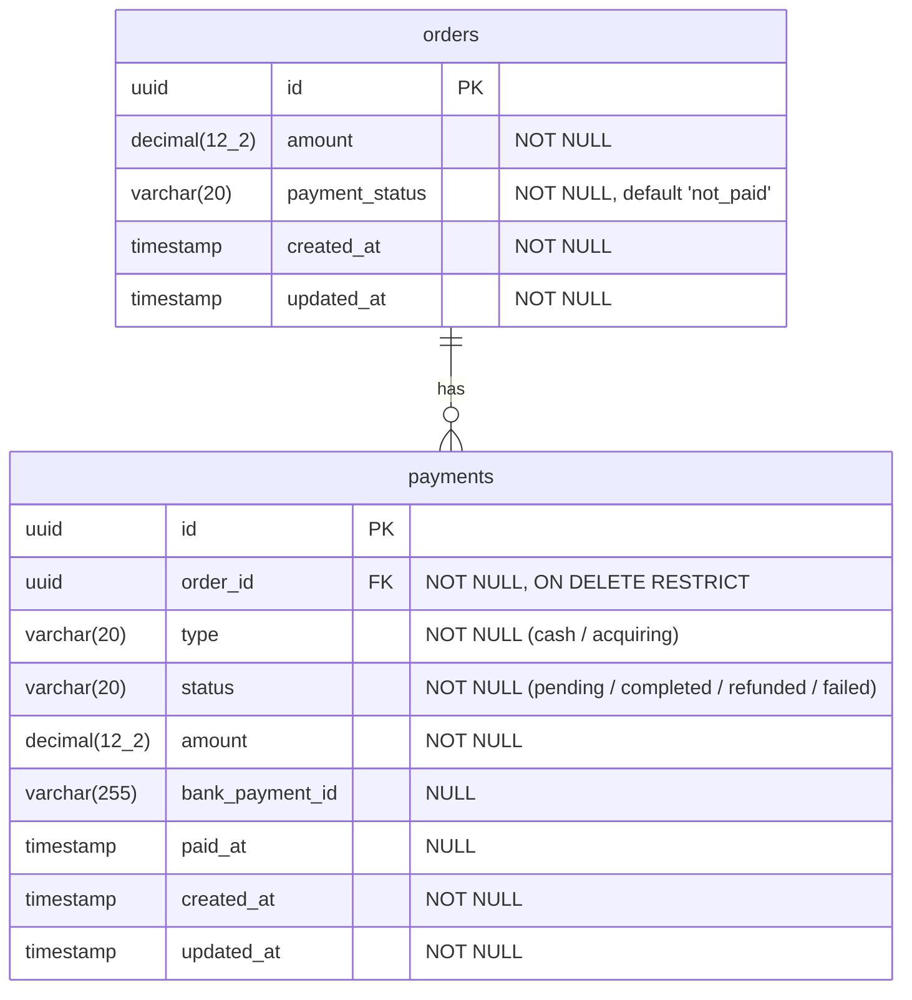

# Схема базы данных

## ER-диаграмма

## Таблица orders

Заказы предзаполнены через seed-миграцию. CRUD не предусмотрен — сервис работает только с платежами.

| Поле | Тип | Описание |
| --- | --- | --- |
| `id` | `uuid` PK | Идентификатор заказа |
| `amount` | `decimal(12,2)` | Сумма заказа |
| `payment_status` | `varchar(20)` | Статус оплаты: `not_paid`, `partially_paid`, `paid` |
| `created_at` | `timestamp` | Дата создания |
| `updated_at` | `timestamp` | Дата обновления |

## Таблица payments

| Поле | Тип | Описание |
| --- | --- | --- |
| `id` | `uuid` PK | Идентификатор платежа |
| `order_id` | `uuid` FK → `orders.id` | Заказ, к которому привязан платёж |
| `type` | `varchar(20)` | Тип: `cash`, `acquiring` |
| `status` | `varchar(20)` | Статус: `pending`, `completed`, `refunded`, `failed` |
| `amount` | `decimal(12,2)` | Сумма платежа |
| `bank_payment_id` | `varchar(255)` NULL | ID платежа в банке (только для acquiring) |
| `paid_at` | `timestamp` NULL | Дата оплаты |
| `created_at` | `timestamp` | Дата создания |
| `updated_at` | `timestamp` | Дата обновления |

## Связи

- `payments.order_id` → `orders.id` с `ON DELETE RESTRICT` — удаление заказа при наличии платежей запрещено
- Один заказ может иметь множество платежей (1:N)
