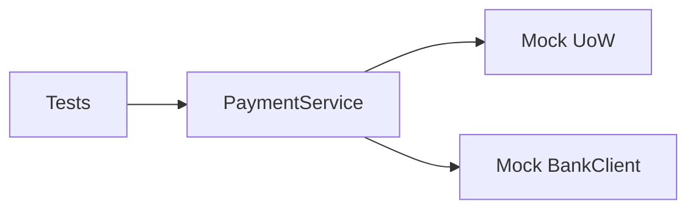

# Тестирование

## Запуск

```bash
docker compose exec backend python -m pytest tests/ -v
```

## Подход

Unit-тесты с моками — без БД, Docker-зависимостей и сети. UoW и BankClient заменяются на `AsyncMock`, что позволяет тестировать бизнес-логику изолированно.



## Структура

```text
tests/
├── conftest.py              — фикстуры (uow) и фабрики (make_order, make_payment)
├── test_payment_service.py  — unit-тесты бизнес-логики (16 тестов)
└── test_schemas.py          — тесты валидации входных данных (6 тестов)
```

## Покрытие

### PaymentService.deposit (7 тестов)

| Тест | Сценарий |
| --- | --- |
| `test_cash_deposit_creates_completed_payment` | Cash-платёж создаётся со статусом `completed` |
| `test_deposit_order_not_found` | Несуществующий заказ → `NotFoundError` |
| `test_deposit_exceeds_order_amount` | Сумма платежей превышает заказ → `ValueError` |
| `test_deposit_counts_pending_in_limit` | Pending-платежи учитываются в лимите суммы |
| `test_deposit_ignores_refunded_in_limit` | Refunded-платежи не блокируют новые |
| `test_acquiring_deposit_calls_bank` | Acquiring вызывает банк, сохраняет `bank_payment_id`, статус `pending` |
| `test_acquiring_deposit_bank_error` | Ошибка банка → `RuntimeError` |

### PaymentService.refund (3 теста)

| Тест | Сценарий |
| --- | --- |
| `test_refund_completed_payment` | Completed → refunded |
| `test_refund_payment_not_found` | Несуществующий платёж → `NotFoundError` |
| `test_refund_non_completed_payment` | Возврат не-completed → `ValueError` |

### PaymentService.sync_payment (3 теста)

| Тест | Сценарий |
| --- | --- |
| `test_sync_payment_not_found` | Несуществующий платёж → `NotFoundError` |
| `test_sync_non_bank_payment` | Cash-платёж без `bank_payment_id` → `ValueError` |
| `test_sync_bank_error` | Таймаут банка → `RuntimeError` |

### Пересчёт статуса заказа (3 теста)

| Тест | Сценарий |
| --- | --- |
| `test_no_payments_sets_not_paid` | Нет completed-платежей → `not_paid` |
| `test_partial_payment_sets_partially_paid` | Частичная оплата → `partially_paid` |
| `test_full_payment_sets_paid` | Полная оплата → `paid` |

### Валидация PaymentCreate (6 тестов)

| Тест | Сценарий |
| --- | --- |
| `test_valid_cash_payment` | Корректные данные проходят |
| `test_zero_amount_rejected` | amount = 0 → `ValidationError` |
| `test_negative_amount_rejected` | amount < 0 → `ValidationError` |
| `test_too_many_digits_rejected` | Больше 12 цифр → `ValidationError` |
| `test_too_many_decimal_places_rejected` | Больше 2 знаков после запятой → `ValidationError` |
| `test_invalid_type_rejected` | Невалидный тип платежа → `ValidationError` |
